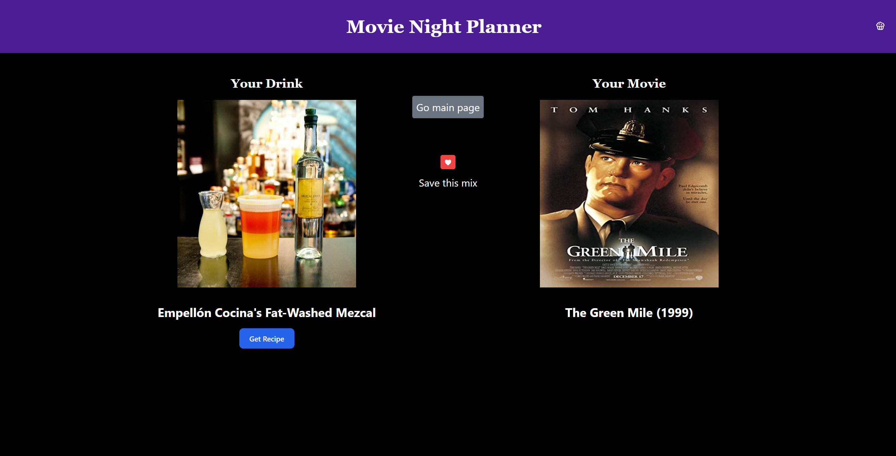

# Movie Planner

## Table of Contents
- [Description](#description)
- [Usage](#usage)
- [Screenshot](#screenshot)
- [License](#license)

## Description

Movie Planner is designed to add an extra layer of enjoyment to your movie nights. It's a simple and entertaining application that lets you explore new cocktail recipes and discover movies you might have never considered watching before. Whether you're hosting a movie night with friends or just relaxing alone, Movie Planner is here to make your movie experience even more delightful.

## Usage

1. Launch the Movie Planner application by clicking on the following link: [Movie Planner](cidherp2.github.io/Movie-Night/).
2. The app will prompt you to select one type of liquor from a provided list. You can choose from options like vodka, rum, gin, tequila, whiskey, etc.
3. After choosing your preferred liquor, the app will then ask you to select your mood. Each mood represents movie genres such as action, comedy, drama, sci-fi, romance, etc.
4. Once you've made your selections, click the "Next" button.
5. Movie Planner will now present you with a random cocktail recipe based on your chosen liquor and a movie recommendation that matches your selected genre.
6. Enjoy your movie and cocktail combination!

Please note that the cocktail recipes provided are for informational purposes only. Always drink responsibly and adhere to legal drinking age restrictions in your country.

## Screenshot

## License

Movie Planner is released under the [MIT License](https://opensource.org/licenses/MIT). Feel free to modify and distribute the application as per the terms of the MIT License. However, please give appropriate credit to the original creators.

**Disclaimer:** Movie Planner is a fictional application created for demonstrative purposes only. Any resemblance to real apps or services is purely coincidental.
